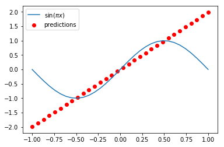
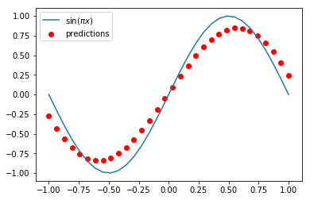

## Continuous-variable quantum neural networks

This is an attempt to implement one of the results of the paper [Continuous-variable quantum neural networks](https://arxiv.org/abs/1806.06871) using Xanadu's [strawberryfields](https://github.com/XanaduAI/strawberryfields), which is "a full-stack Python library for designing, simulating, and optimizing continuous variable (CV) quantum optical circuits". More specifically, I used a variational quantum circuit to learn the `sin(np.pi*x)` function on the interval [-1,1]. The function implemented by the circuit before the optimization is a line:

After the optimization, it's more or less the sine function:

if you want to know more about the continuous-variable model of quantum computing, check out Xanadu's [white paper](https://arxiv.org/abs/1804.03159).
